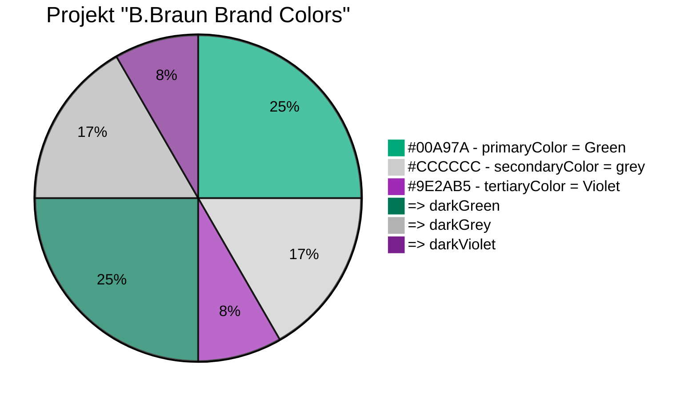

# Mermaid

## Beispiel B.Braun Brand Colors

```mermaid
%%{
  init: {
    'theme': 'base',
    'themeVariables': {
      'primaryColor': '#00a97a',
      'primaryTextColor': '#000000',
      'primaryBorderColor': '#ffffff',
      'lineColor': '#000000',
      'secondaryColor': '#CCCCCC',
      'tertiaryColor': '#9e2ab5'
    }
   }
}%%
pie title Projekt "B.Braun Brand Colors"
    "#00A97A - primaryColor = Green " : 3
    "#CCCCCC - secondaryColor = grey" : 2
    "#9E2AB5 - tertiaryColor = Violet" : 1
    "=> darkGreen " : 3
    "=> darkGrey" : 2
    "=> darkViolet" : 1
```
