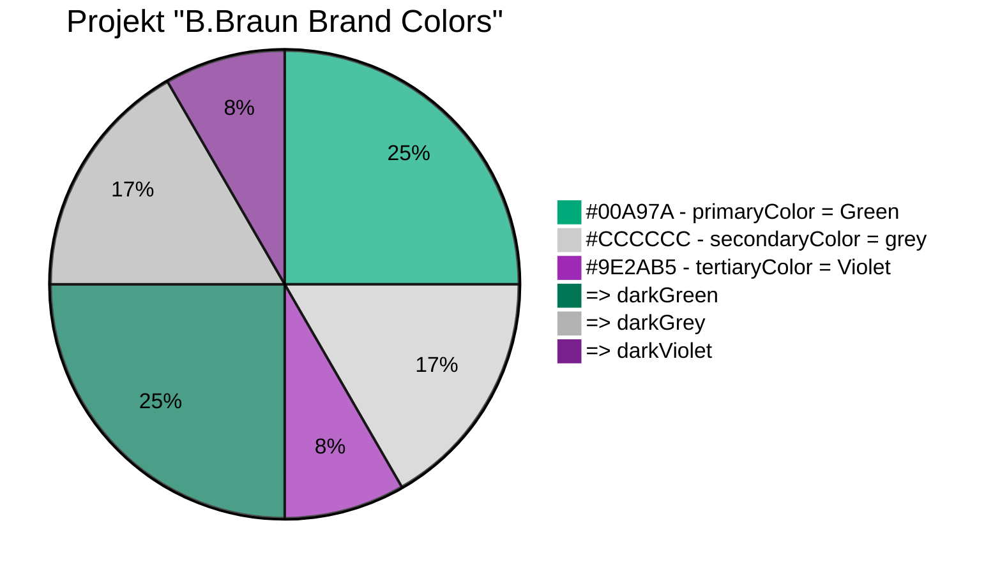

# Mermaid (Mermaid Markup Language - MML)

## Beschreibung

Mermaid ist eine Software-Anwendung, die es Benutzern ermöglicht, Diagramme und Flussdiagramme in einem einfachen Textformat zu erstellen. Es basiert auf einer Sprache namens Mermaid Markup Language (MML), die eine Möglichkeit bietet, Grafiken und Diagramme direkt in einer Textdatei zu erstellen.  

<details><summary>Details siehe Kurzbeschreibung</summary>
<p>
Mit Mermaid können Benutzer verschiedene Arten von Diagrammen wie Flussdiagramme, Gantt-Diagramme, Klassendiagramme, Zustandsdiagramme und mehr erstellen. Die erstellten Diagramme können als SVG-, PNG- oder PDF-Datei exportiert werden und können in HTML- oder Markdown-Dokumente eingebettet werden.  
Mermaid ist eine Open-Source-Software und kann kostenlos verwendet werden. Es ist plattformunabhängig und kann in verschiedenen Umgebungen wie der Kommandozeile, Node.js und Webbrowsern verwendet werden. Es ist eine einfache und effektive Möglichkeit, Diagramme und Flussdiagramme zu erstellen, ohne eine separate Anwendung oder Software installieren zu müssen.
</p>
</details>

 [Mermaid Live Editor](https://mermaid.live/edit) 

<details><summary>Zusammenfassung</summary>
<p>
Mermaid ist eine Open-Source-Software zur Erstellung von Diagrammen, Flussdiagrammen, Organigrammen, Gantt-Diagrammen und anderen grafischen Darstellungen. Mermaid ermöglicht es Benutzern, Diagramme in Textform zu schreiben und automatisch in visuell ansprechende Grafiken umzuwandeln. Die Diagramme können in verschiedenen Formaten exportiert werden und sind ideal für die Verwendung in technischen Dokumentationen, Präsentationen oder Webseiten. Mermaid unterstützt eine Vielzahl von Diagrammtypen und bietet eine einfache Syntax, die schnell erlernt werden kann. Die Software kann als eigenständige Anwendung oder als JavaScript-Bibliothek in andere Anwendungen integriert werden.  
```Quelle: ChatGPT 2023-03-06 ```
</p>
</details>

## Verwendung

### Beispiel B.Braun Brand Colors


Die verwendete Syntax kann direkt in GitHub editiert werden und im Preview auf systaktische Fehler kontrolliert werden.  
**Alternativ:** Den jeweiligen Code mittels des angezeigten Buttons kopieren und in den [Mermaid Live Editor](https://mermaid.live/edit) kopieren.
